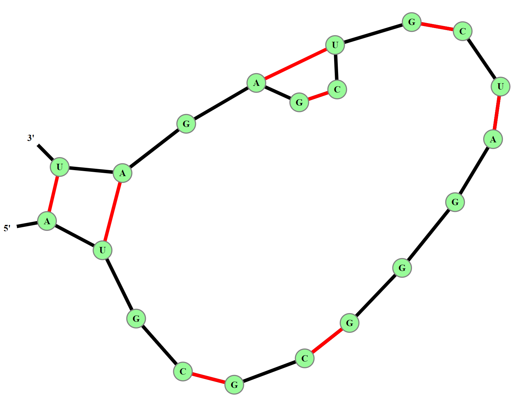

# Visual Implementation of the Nussinov Algorithm

This repository contains the final project for the Fall 2022 semester for CS 466 at Illinois. The project report is available [here](doc/CS466_Final_Project_Report.pdf)

## Contents

  1. [Usage instructions](#usage)
  2. [Team Members](#team)

## Usage instructions

### GitHub Pages Site

Please visit the GitHub Pages [site](https://srikur.github.io/nussinov-viz/) for this project in order to use the web application. There are no dependencies or installations required, other than having Javascript enabled in your browser.

### Inputting Sequences

The web application accepts an RNA sequence as input, and only allows for the capital letters "A", "U", "C", and "G" to be input. Any other character will not be accepted. Similarly, the hairpin loop length must be an integer, while the same applies for the graph paramters (in order for the graph to be properly generated).

### Modifying the Graph

The nodes on the force-directed graph visualization can be dragged, which often helps "detangle" structures. Please try this if you find that the predicted structure looks as if nodes or links are overlapping.

## Team Members

[Srikur Kanuparthy](https://github.com/srikur) 
Isabella Lebovic 
Neha Kaki